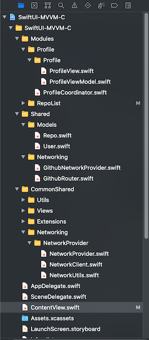

# SwiftUI-MVVM-C
A template project that uses SwiftUI for UI, Combine for event handling, MVVM-C for software architecture.

I have done some small projects using SwiftUI. It is really cool, simple and fast, but also have some thing need to be improved, that surely will be improved by Apple in the future. After that, I have been improving the project structure little by little, restructure it with the MVVM-C architecture, what I have used in most UIKit projects before. Today, I am publishing a simple project, that conclude what I have learned, used in my SwiftUI projects.

## Compatibility
- iOS 14 and later
- SwiftUI 2
- Swift 5 and later

## Project overview
The project uses the GitHub API to load a repo list of a user, show repo details when users tap on a repo. You can also tap on the top right icon to see user's profile. In this project, it is showing my repos. You can change it in `RepoListCoordinator.swift`.

The project uses MVVM-C (aka Model - View - ViewModel - Coordinator). Why there is Coordinator here? The Coordinator is an addition part for the MVVM, that help us to separate navigation handling code to a different place, instead of putting it in the View (or View Controller in UIKit). It makes the view (or view controller in UIKit) more reusable, smaller. In my SwiftUI projects, Coordinator is a View, but only for handling navigation event purpose.

## What you can find in this project
- MVVM-C implement with SwiftUI and Combine framework.
- Networking with Combine framework, written in the way that help to test it, and integrate other 3rd parties API easily.
- Unit test: Mock network data, view model test, dependency injection, etc.
- Some useful extensions.
- Structure of a SwiftUI project.

## Project structure

## License
Copyright huynguyencong,  Licensed under the MIT license.
